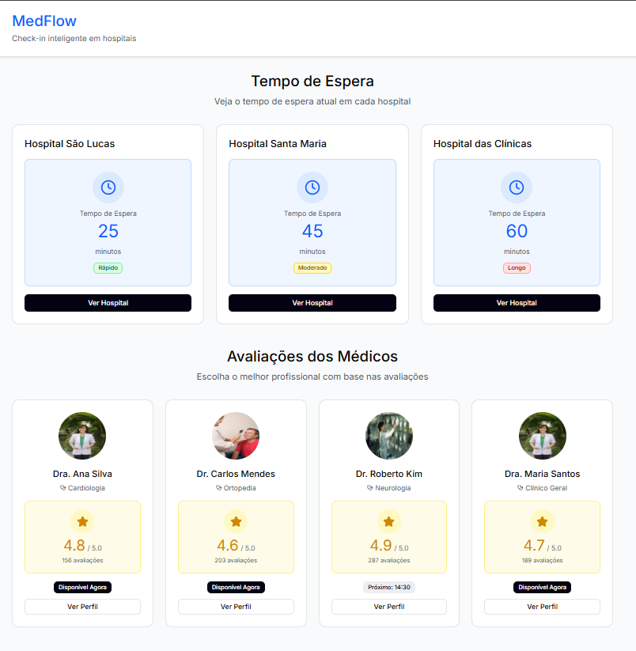
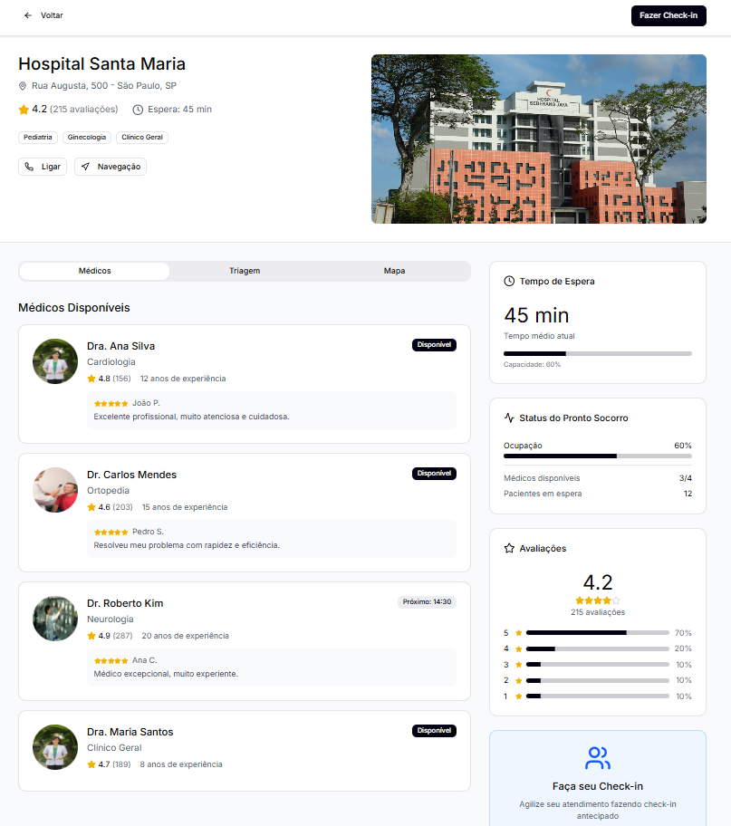
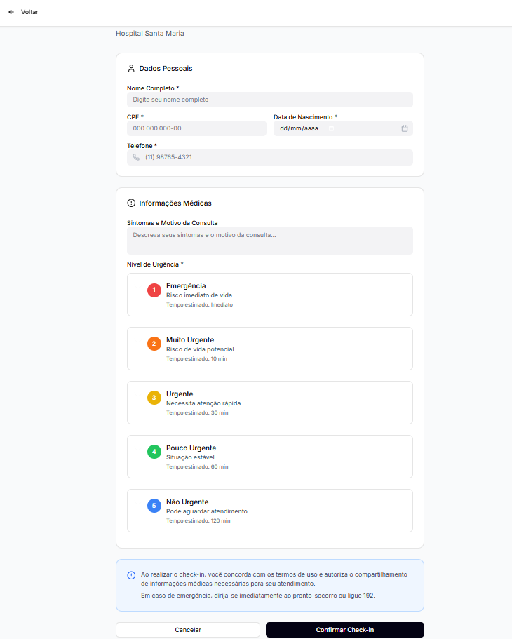
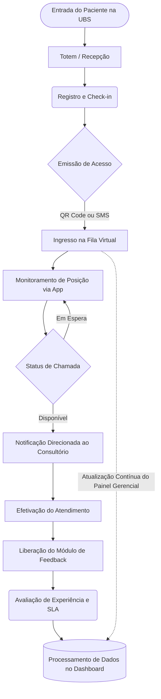

# MedFlow: Sistema de Gestão de Filas e Feedback para UBS

---

## Visão Geral do Projeto

Este projeto foi desenvolvido como requisito para a disciplina de Usina de Projetos Experimentais I (UPX I). O objetivo central é projetar e implementar um sistema tecnológico que permita aos pacientes monitorar sua posição na fila de uma Unidade Básica de Saúde (UBS) em tempo real, além de fornecer um canal estruturado para feedback do atendimento.

A solução é pautada na **otimização logística do fluxo de pacientes**. Utilizando o conceito de Produto Mínimo Viável (MVP), o MedFlow visa mitigar um problema crônico na infraestrutura de saúde pública: a imprevisibilidade do tempo de espera e a ausência de dados analíticos para suporte à tomada de decisão gerencial.

## Equipe de Desenvolvimento (Click Byte)

Projeto idealizado e estruturado pelos acadêmicos:
* Ana Laura
* Celso Toledo
* José Leonardo
* Márcia Regina
* Raphael do Santos
* Vítor Zan

## Arquitetura da Solução e Tecnologias

Para garantir a eficiência operacional, o sistema contempla as seguintes funcionalidades logísticas:
* **Monitoramento de Fila:** Acompanhamento dinâmico da posição do paciente, descentralizando a sala de espera e reduzindo a superlotação física.
* **Gestão de Feedback:** Módulo de avaliação pós-atendimento, focado na coleta de métricas de qualidade e tempo de ciclo.
* **Dashboard Administrativo:** Painel de controle para monitoramento de fluxo, balanceamento de capacidade e gestão de demanda da UBS.

**Stack Tecnológico e Metodológico:**
* **Desenvolvimento do MVP (No-Code):** Figma (utilizado nesta etapa para simulação lógica e prototipagem de alta fidelidade).
* **Gestão de Projeto:** Frameworks Ágeis (Scrum/Kanban) gerenciados via Trello.

## Alinhamento Estratégico e Impacto Social (ODS)

A plataforma MedFlow foi desenhada para otimizar a alocação de recursos públicos e humanizar o atendimento, em conformidade com os Objetivos de Desenvolvimento Sustentável (ODS) da ONU:
* **ODS 3 (Saúde e Bem-Estar):** Redução do estresse do paciente ao conferir transparência e previsibilidade ao processo de triagem e atendimento.
* **ODS 16 (Paz, Justiça e Instituições Eficazes):** Fomento à transparência e eficiência operacional nas instituições de saúde, gerando métricas auditáveis.

## Produto Mínimo Viável (MVP) e Validação Lógica

Nesta fase inicial do projeto, o **Figma atua como a nossa plataforma *no-code/low-code***. Ele foi estruturado não apenas para o design de interface (UI/UX), mas para funcionar como o MVP em si, simulando as regras de negócio, a transição de estados da fila e o fluxo completo de interação do usuário. Isso permite a validação da solução e da arquitetura da informação sem a necessidade imediata de codificação tradicional.

**[Acessar a Solução Interativa (MVP) no Figma](https://www.figma.com/make/U2mrWrfeIeoJwvnx4yyAb1/Hospital-Check-in-App?p=f&t=5kHQXmxwswEJyfPu-0)**

  
  
  

## Modelagem do Fluxo Logístico

O diagrama abaixo ilustra o mapeamento do processo, detalhando a jornada do paciente e os pontos de integração de dados:

**Descritivo Operacional:**
1. **Input (Check-in):** Identificação inicial do paciente e emissão do acesso à fila virtual.
2. **Processamento (Espera Virtual):** Monitoramento remoto via smartphone, mitigando a ociosidade presencial e a superlotação física.
3. **Roteamento (Convocação):** Notificação automatizada no momento exato do atendimento, otimizando o deslocamento interno.
4. **Output (Avaliação):** Coleta de feedback sobre a conformidade do serviço (SLA de tempo) e infraestrutura.
5. **Retroalimentação (Analytics):** Consolidação dos dados logísticos para suporte direto à gestão de recursos.

## Manual de Operação

**Perfil Paciente (Usuário Final):**
* Realize o acesso via QR Code disponibilizado na triagem/recepção da UBS.
* Autentique-se utilizando a credencial registrada (Prontuário/CPF).
* Acompanhe o status e o tempo estimado de atendimento no painel principal.
* Ao finalizar o atendimento, registre sua avaliação no formulário de satisfação.

**Perfil Gestor (Administrador):**
* Acesse o sistema mediante credenciais de administração.
* Navegue até o Painel de Controle (Dashboard) para monitoramento de KPIs.
* Avalie relatórios em tempo real referentes à densidade da fila e tempos médios de ciclo.
* Empregue a inteligência de dados para o balanceamento logístico da equipe médica.

## Análise de Mercado e Proposta de Valor

A arquitetura do MedFlow fundamenta-se em um diagnóstico das restrições logísticas e operacionais do Sistema Único de Saúde (SUS).

**Dores do Mercado (Gargalos Identificados):**
* **Perspectiva do Usuário:** Ociosidade e ansiedade resultantes de tempos de espera não quantificados em ambientes com capacidade física limitada.
* **Perspectiva da Gestão:** Déficit de inteligência de dados gerenciais em tempo real. A ausência de métricas digitalizadas impede a rápida identificação de estrangulamentos na cadeia de atendimento.

**A Solução MedFlow:**
O projeto digitaliza o sequenciamento do atendimento. Ao prover previsibilidade ao paciente, eleva-se a percepção de qualidade do serviço público. Paralelamente, os gestores são municiados com relatórios estruturados, permitindo alocações logísticas precisas e otimização dos recursos operacionais da UBS.
---

*Documentação estruturada para validação da disciplina de Usina de Projetos Experimentais I (UPX I).*
